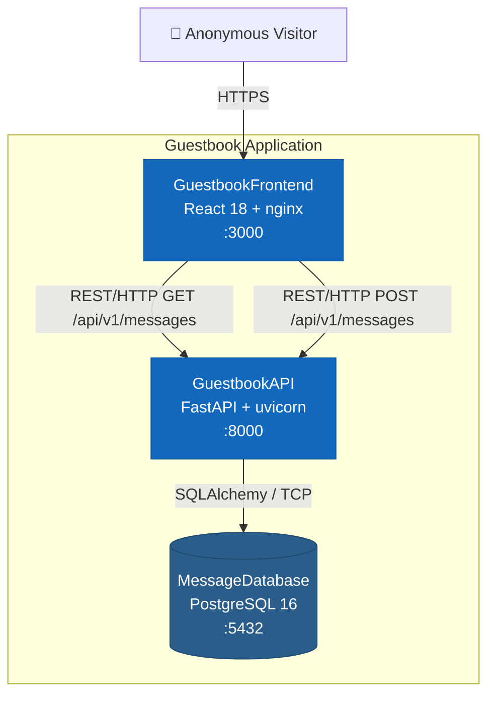
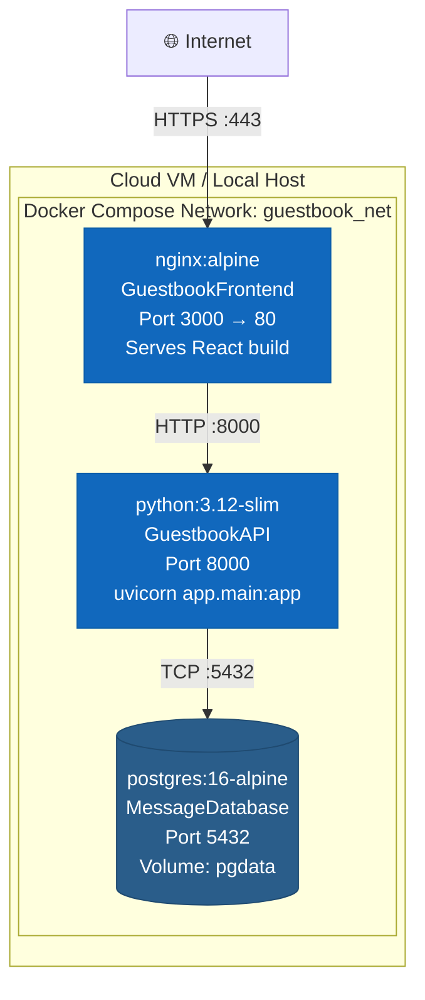
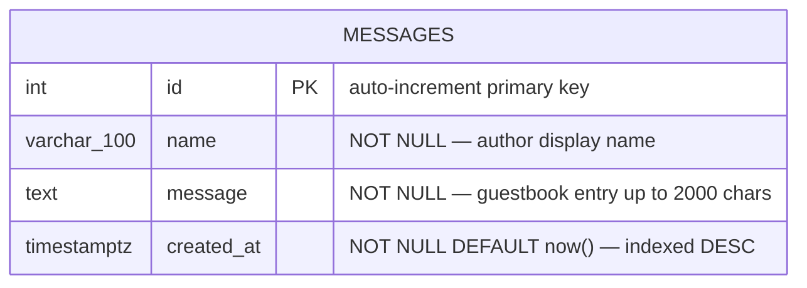
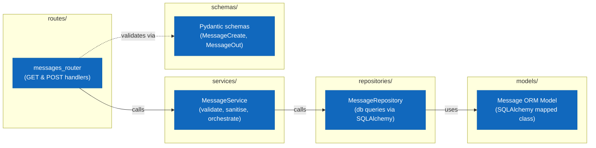
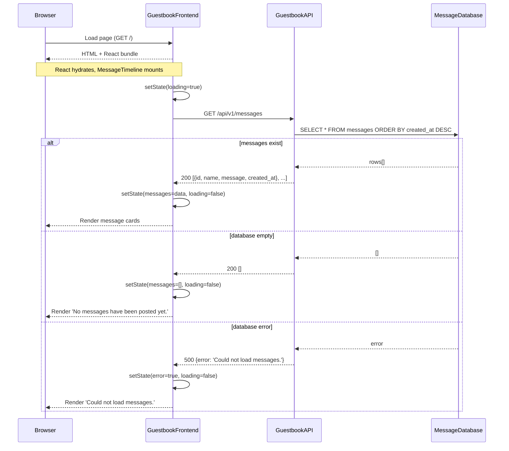
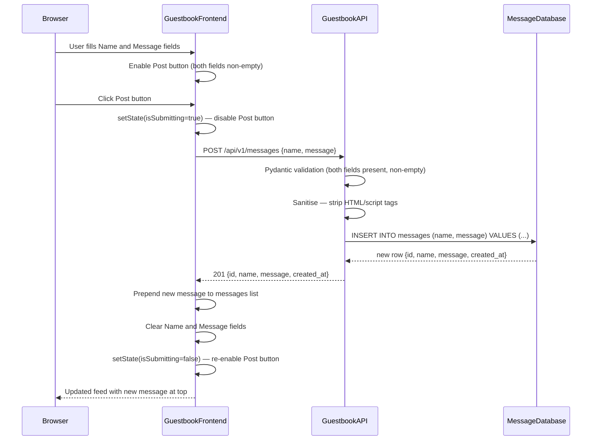
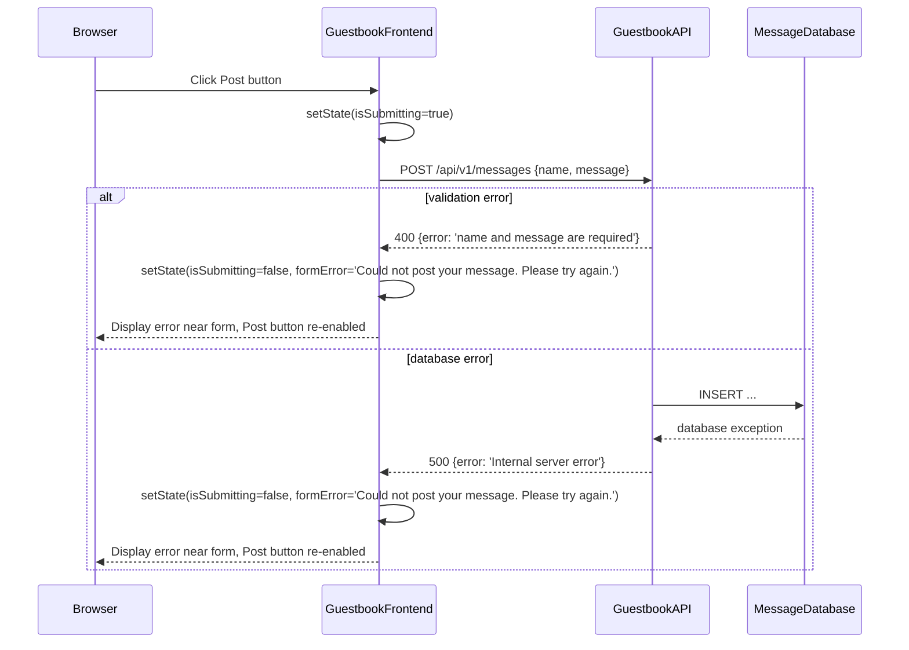
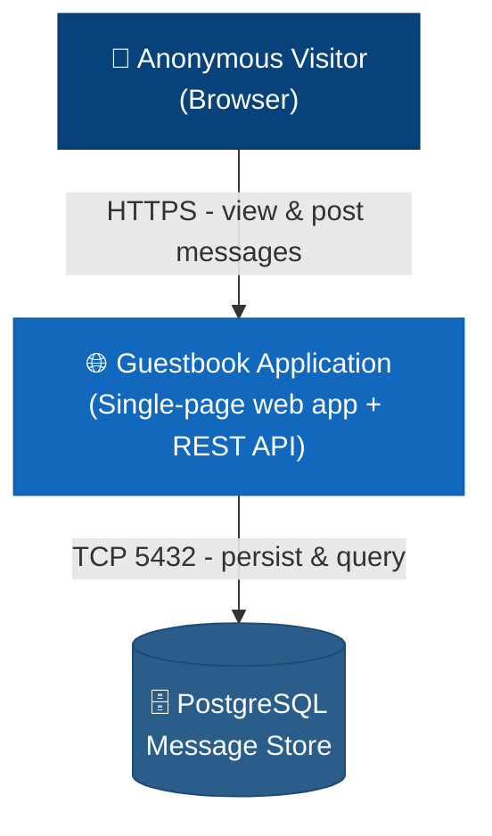

# Architecture Diagrams — tip-calculator

> Generated by Elite AI Pod's Solution Architect agent on 2026-08-11T10:30+00:00.
> Mermaid diagrams render natively on GitHub.

## Guestbook — Container Diagram

C4 Level 2 view showing the three containers: React SPA served by nginx, FastAPI backend, and PostgreSQL database. Arrows show HTTP and TCP communication channels.

## Guestbook — End-to-End Data Flow

End-to-end data flow from user input through sanitisation, persistence, and rendering, highlighting the two XSS prevention points: server-side sanitisation at the API layer and textContent rendering in the browser.

```mermaid
graph LR
    A["User Input\nname + message"] -->|JSON POST body| B["Pydantic Validation\n(GuestbookAPI)"]
    B -->|validated fields| C["Sanitisation Layer\n(bleach.clean — strip HTML/script tags)"]
    C -->|sanitised strings| D["MessageRepository\nINSERT INTO messages"]
    D -->|persisted row| E[("PostgreSQL\nmessages table")]

    E -->|SELECT ORDER BY created_at DESC| F["MessageRepository\nfetch all"]
    F -->|List of Message objects| G["GET /api/v1/messages\nJSON response"]
    G -->|JSON array| H["React MessageTimeline\nmap to JSX"]
    H -->|textContent only — no innerHTML| I["Browser DOM\nSafe rendered cards"]

    style C fill:#d4380d,color:#fff
    style H fill:#d4380d,color:#fff
```

## Guestbook — Deployment Topology

Docker Compose single-host deployment with three containers: nginx serving React static files on port 3000, FastAPI via uvicorn on port 8000, and PostgreSQL on port 5432. All containers share an internal Docker network.

## Guestbook — Entity Relationship Diagram

Single-entity ERD for the messages table. No relationships between entities as the guestbook has no user accounts or foreign keys. Includes the created_at DESC index for query performance.

## Guestbook API — Internal Module Interaction

Internal module boundaries within the GuestbookAPI: routes delegate to service layer for business logic and sanitisation, service calls repository for database operations, repository uses SQLAlchemy models.

## Sequence Diagrams

### US-001 — Load Message Timeline

Sequence showing page load: browser fetches static assets, React mounts and calls GET /api/v1/messages, backend queries database ordered by created_at DESC, returns list, frontend renders timeline.

### US-002 / US-003 — Submit Message and Feed Update

Sequence covering form fill, Post button click, API call with validation and sanitisation, 201 response, optimistic prepend to feed, and form clear.

### US-002 / US-003 — Submission Failure Handling

Sequence showing error path when POST /api/v1/messages fails: validation error (400) or server error (500). Post button re-enables and user-friendly error message is displayed.

## Guestbook — System Context

C4 Level 1 view showing the anonymous visitor as the sole actor interacting with the Guestbook Application over HTTPS. No external dependencies beyond the hosted database.

